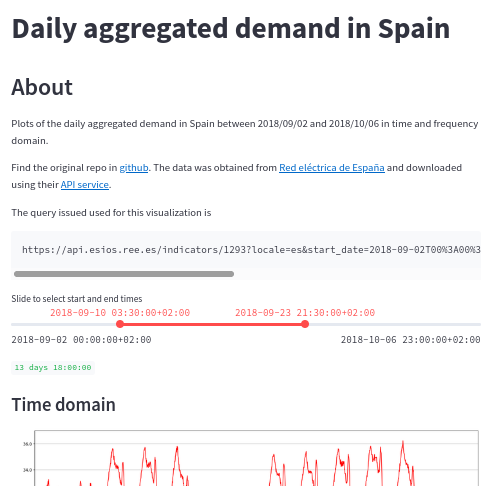
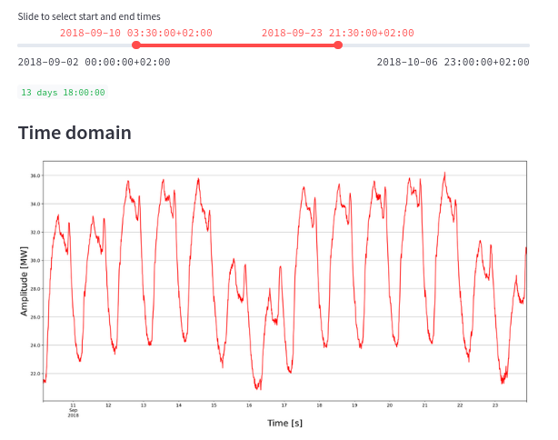
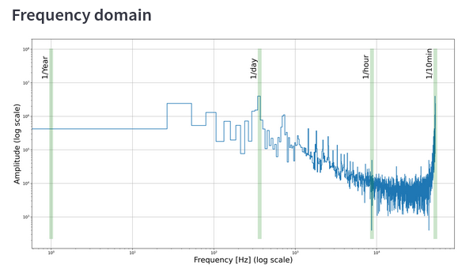

# About

Code and notebooks for the a small streamlit app that requests demand data from the ESIOS REST API and displays it in time and frequency domain.

## Goals

1. The script should be able to download the real electricity demand ([Demanda Real](https://www.esios.ree.es/es/analisis/1293?vis=1&start_date=16-10-2019T00%3A00&end_date=16-10-2019T23%3A50&compare_start_date=15-10-2019T00%3A00&groupby=minutes10)) from the Spanish electricity grid during the period 02/09/2018-06/10/2018. This information is easily accessible through its [API](https://api.esios.ree.es/). For this you will need a valid token that you can request in the following mail:
   [consultasios@ree.es](mailto:consultasios@ree.es?subject=Solicitud%20de%20token%20personal). The variable that we want you to analyze concretely has the ID **1293.**
2. Tries to decompose the obtained signal (power demand) using Fast Fourier
   Transform. You can use the fftpack module of the scipy bookstore or the
   one you think is more appropriate. Basically we need to convert a signal
   from its original domain (time) to a representation in the frequency
   domain to detect patterns. Hopefully, you can expect a result similar to this:

## Deploy streamlit app using docker-compose

1. Create an `.env` file and add your token as an environment variable named `ESIOS_TOKEN`. Check `.env.example` for an example.
2. With docker-compose, run `docker-compose up -d`
3. Go to <http://0.0.0.0:8501/>
4. You should be able to interact with the app

