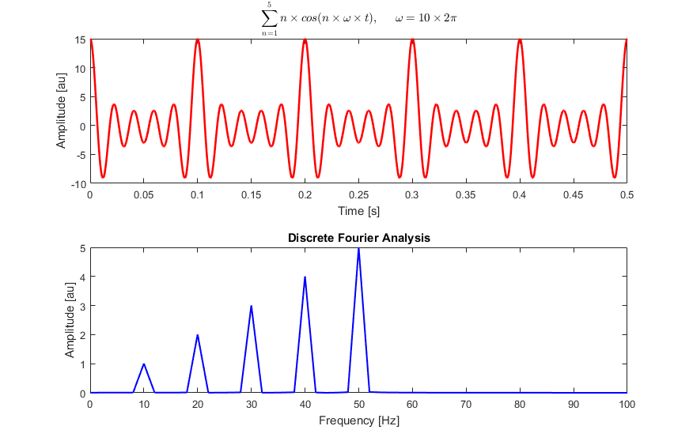

# About

Code and notebooks for the aiguasol challenge

# Challenge description

This exercise consists of a series of tasks that aim to assess your skills in the following fields:

- Basic Python programming (including object oriented programming). The
structuring of the code in classes and libraries will be valued
positively.
- Access to data through APIs. In many of our projects it is necessary to
collect information from multiple sources, mainly from the web
environment.
- Time series analysis and management. A correct analysis of the information
collected for later use is essential. There are multiple python
libraries that can be easily adapted to our needs.

Proposed exercise:

1. Your script should be able to download the real electricity demand ([Demanda Real](https://www.esios.ree.es/es/analisis/1293?vis=1&start_date=16-10-2019T00%3A00&end_date=16-10-2019T23%3A50&compare_start_date=15-10-2019T00%3A00&groupby=minutes10)) from the Spanish electricity grid during the period 02/09/2018-06/10/2018. This information is easily accessible through its [API](https://api.esios.ree.es/). For this you will need a valid token that you can request in the following mail:
[consultasios@ree.es](mailto:consultasios@ree.es?subject=Solicitud%20de%20token%20personal). The variable that we want you to analyze concretely has the ID **1293.**
2. Tries to decompose the obtained signal (power demand) using Fast Fourier 
Transform. You can use the fftpack module of the scipy bookstore or the 
one you think is more appropriate. Basically we need to convert a signal
 from its original domain (time) to a representation in the frequency 
domain to detect patterns. Hopefully, you can expect a result similar to this:

